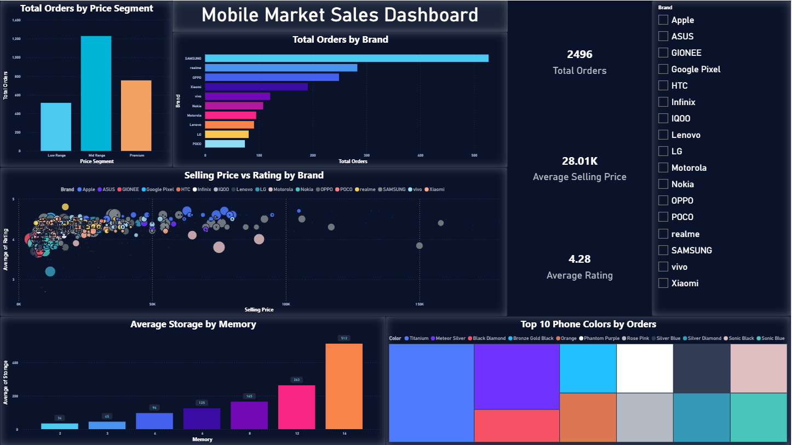

# Flipkart Sales Dashboard (Power BI)


> An interactive Power BI dashboard that transforms raw Flipkart sales data into clear, actionable business insights.

---

##  Table of Contents

- [Project Overview](#-project-overview)
- [Dashboard Preview](#-dashboard-preview)
- [Key Insights](#-key-insights)
- [Tools Used](#-tools-used)
- [Project Structure](#-project-structure)
- [How to Use](#-how-to-use)
- [Project Goal](#-project-goal)
- [Author](#-author)

---

## 🎯 Project Overview

This project analyzes **Flipkart sales data** using **Power BI** to uncover patterns in product performance, sales trends, and customer behavior.

Raw transactional sales data is cleaned, modeled, and visualized into a single interactive dashboard — turning scattered rows of sales records into insights that are easy to read, filter, and act on.

---

## 🖼️ Dashboard Preview

<p align="center">
  
</p>

*(See the `Screenshot` folder for the full-resolution dashboard views.)*

---

## 🔍 Key Insights

The dashboard surfaces the following insights:

| Insight | Description |
|---|---|
| 💰 Sales Distribution by Price Segment | Breaks down total sales across different price ranges |
| 🏷️ Product Category Performance | Compares revenue and volume across product categories |
| 📈 Sales Trends Over Time | Tracks how sales evolve across time periods |
| 🧑‍🤝‍🧑 Customer Purchasing Patterns | Highlights recurring behaviors in how customers buy |
| ⭐ High-Performing Products | Identifies top products driving the most sales |

---

## 🛠️ Tools Used

| Category | Tools |
|---|---|
| Visualization & Reporting | Power BI |
| Data Preparation | Data Cleaning (Power Query) |
| Data Source | Flipkart Sales Dataset (CSV) |

---

## 📁 Project Structure

```
Flipkart-Sales-Dashboard/
│
├── Screenshot/                # Dashboard preview images
├── Flipkart_Dashboard.pbix    # Power BI dashboard file
└── README.md
```

---

## ▶️ How to Use

1. Clone or download this repository:
   ```bash
   git clone https://github.com/khaled-amireh/Flipkart-Sales-Dashboard.git
   ```
2. Open **`Flipkart_Dashboard.pbix`** in [Power BI Desktop](https://www.microsoft.com/en-us/power-platform/products/power-bi/downloads).
3. Explore the report pages and use the built-in filters/slicers to drill into specific categories, price segments, or time periods.

---

## 🎯 Project Goal

The goal of this project is to practice **end-to-end data analysis and visualization** using real-world sales data — from cleaning raw records to designing a dashboard that communicates insights clearly and supports data-driven decisions.

---

## 👤 Author

**Khaled Amireh**
[GitHub](https://github.com/khaled-amireh)
